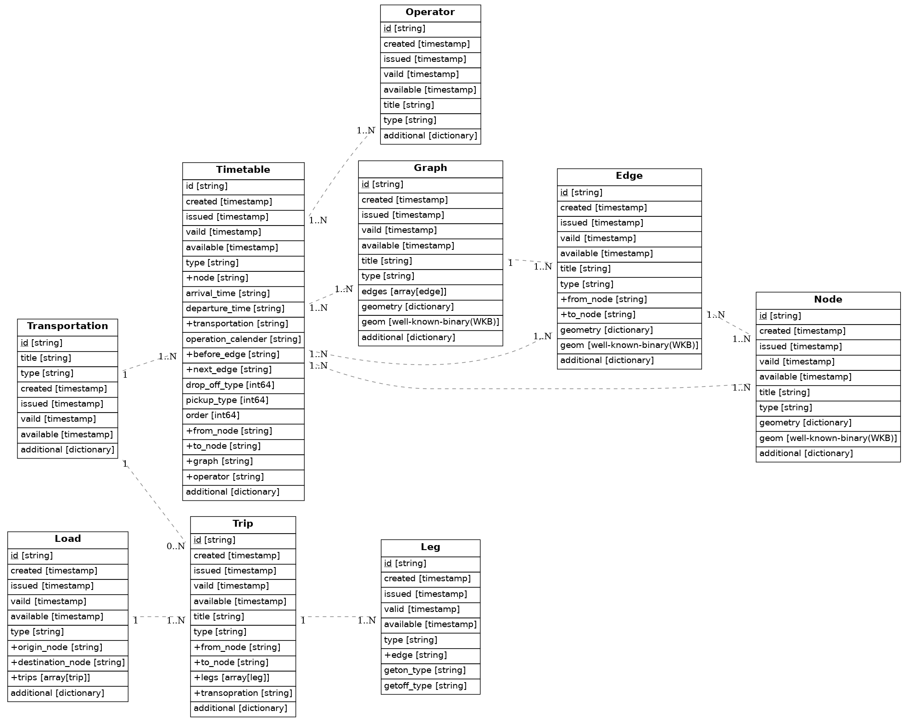
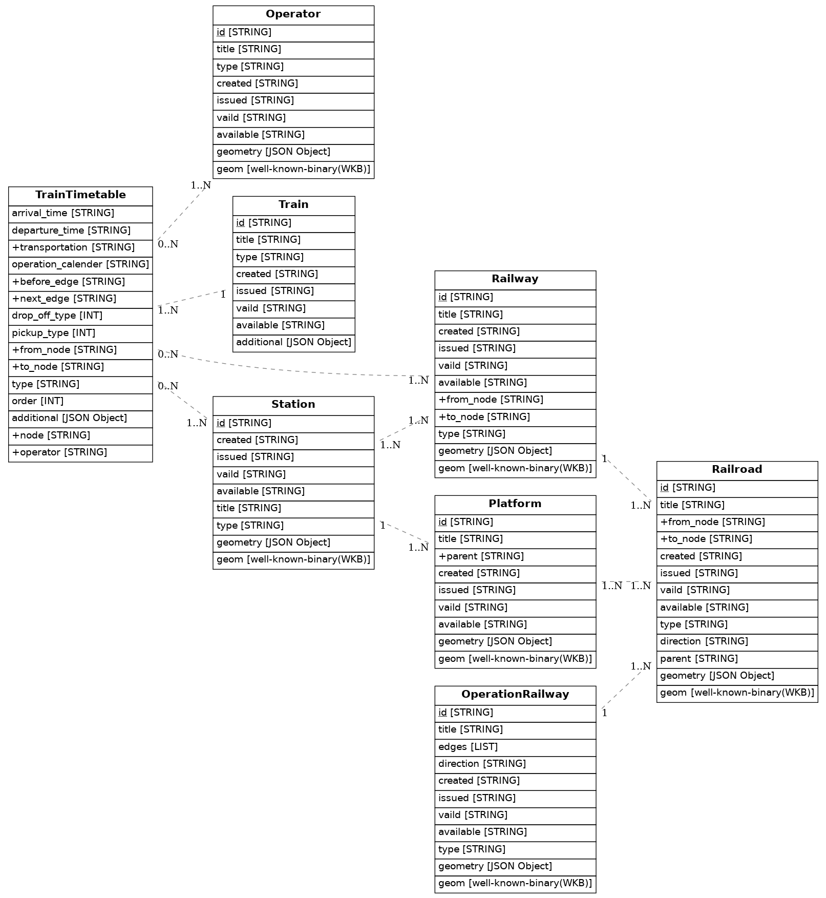

用語 Terms
==========

中間表現 Intermidiate representation  
[中間表現](https://ja.wikipedia.org/wiki/%E4%B8%AD%E9%96%93%E8%A1%A8%E7%8F%BE)（ちゅうかんひょうげん、英:
Intermediate
Representation、IR）は、コンピュータがデータをクロスプラットフォームで扱うために使用するデータ構造の表現である。
中間表現を用いたデータの抽象化はコンピューティング分野では一般的な手法である。異なるプラットフォームで同等の情報を保持するデータを異なるフォーマットで扱う場合に、
データを中間表現で表現することで複数フォーマットへの変換処理を効率化することを手助けする。これは自然言語の翻訳に中間言語を用いるのと同等のメリットがある。

[Intermediate Representation
(IR)](https://ja.wikipedia.org/wiki/%E4%B8%AD%E9%96%93%E8%A1%A8%E7%8F%BE)
is a representation of data structures used by computers to handle data
cross-platform. Data abstraction using intermediate representations is a
common technique in the field of computing. When data holding equivalent
information on different platforms are handled in different formats.
Expressing data in intermediate representations helps to streamline the
process of converting data into multiple formats. This has the same
advantage as using intermediate languages for natural language
translation.

固有識別子 Universally Unique Identifier  
[固有識別子](https://ja.wikipedia.org/wiki/UUID)(UUID:Universally Unique
Identifier)とは、ソフトウェア上でオブジェクトを一意に識別するための識別子である。UUIDは128ビットの数値だが、16進法による550e8400-e29b-41d4-a716-446655440000というような文字列による表現が使われることが多い。元来は分散システム上で統制なしに作成できる識別子として設計されており、したがって将来にわたって重複や偶然の一致が起こらないという前提で用いることができる。マイクロソフトによるGUIDは、UUIDの実装の1つと見なせる。

[UUID:Universally Unique Identifier](https://ja.wikipedia.org/wiki/UUID)
is an identifier that uniquely identifies an object on the software.
UUID is a 128-bit number, and it is often expressed in the form of a
string such as 550e8400-e29b-41d4-a716-446655440000 in hexadecimal
notation. It was originally designed as an identifier that can be
created without control on a distributed system, and therefore can be
used under the assumption that no duplication or coincidence will occur
in the future. The GUID by Microsoft can be seen as one implementation
of a UUID.

エンティティ Entity  
[エンティティ](https://ja.wikipedia.org/wiki/%E3%82%A8%E3%83%B3%E3%83%86%E3%82%A3%E3%83%86%E3%82%A3)とは英語の一般名詞として、組織や団体など物質的な実体に限らず実存する概念のことを指す。

[Entity](https://ja.wikipedia.org/wiki/%E3%82%A8%E3%83%B3%E3%83%86%E3%82%A3%E3%83%86%E3%82%A3)
is a general noun in English that refers to an existential concept that
is not limited to a material entity, such as an organization or
association.

H3  
[H3](https://h3geo.org/)とは、六角形グリッドを使った地理空間インデックスシステムである。

H3 is a geospatial indexing system using a hexagonal grid.

概要 Abstract
=============

TraIIRe(Transport Information Intermediate
Representation)は移動情報の中間表現である。TraIIReは各事業者から出力されるデータを中間表現に変換する。最近、交通情報が各社から提供されるようになってきたが、別々のフォーマットを採用し、事業者間でのデータのやりとりに多大なコストがかかる。現在、GTFSによるデータ提供が各社から開始されつつあるが、乗換及び運行に関する情報にフォーカスしており、移動情報として必要となる施設情報やバリアフリー情報などをやりとりすることはできない。TraIIReでは移動に必要となる情報のやりとりを円滑に行うために必要となる中間表現を定義する。

TraIIRe(Transport Information Intermediate Representation) is an
intermediate representation of movement information. It converts data
output from each operator into an intermediate representation. Recently,
each operator start to providing the traffic information but it does not
include facility and accessibility information because the main focus of
this information is interchange and operation.

移動の基本モデル Basic model of transport
=========================================

移動とは、物体がある手段（移動手段）を利用し、ある時間における場所（位置）から、ある経路を経由して、別の場所（位置）に動くことである。この定義より、移動の定義には以下の要素が必要になると考えられる。

Transport is the movement that object moves from a place to another
place in one time by a transportation via a route. Some component below
is required according to this definition.

-   物体: Object

-   移動手段: Transportation

-   場所（位置）: Place(Coordinate)

-   経路: Route

これら要素を図示すると以下のようになる。

The figure below is shown the cofigrations of those components.

**Basic model of transport.**

scale 2.0 (Node) as N1 (Node) as N2 N1 --right--&gt; N2: Edge legend
center Load endlegend legend center Transportation endlegend

TraIIRe
-------

この構成をコンピューターシステムで扱う場合、場所を頂点、経路を辺としたグラフ構造を形成し、その上を移動体（Object）が動く、というモデルに落とし込める。本システムではこの三点をグラフ構造および移動の中間表現の基底として定義する。さらに交通の運行に必要な情報や、交通を利用する主体、主体の移動する経路を基底に加えることで、あらゆる交通情報を表現する基本モデルを構築する。

When this configuration deal with computer system, it can be
incorporated into a model in which a graph structure with a location as
a vertex and a route as an edge and a object moves on this structure. In
this system, these three points are defined as the base of graph
structure and mobility.

Essential  
Essentialは全てのデータがもつ基底データを定義したものである。TraIIReでは1つのデータを1つのユニークなIDを割り当て、Essentialに格納する。事業者から収集したデータは新設や廃止、改正といった制約により有効期間が定められるため、それらのデータを格納する。各事業者のデータは事業者毎に作成する派生クラスに格納するため、派生クラスの種類やそのクラス固有のプロパティを格納できる。

The Essential defines the base data that each data have to keep. In
TraIIRe, one data is assigned one unique ID and stored in Essential.
Since the validity period of the data collected from the operator is
determined by restrictions such as new establishment, abolition, and
revision, those data should be stored. Since the data of each operator
is stored in the derived class created for each operator, the type of
derived class and the properties unique to that class can be stored.

Node  
Nodeはグラフ構造における頂点を表す。 e.g.
駅のプラットフォーム、バス停標柱、タクシー乗り場、空港のゲート

The Node reperesents for a vertex in a graph structure. It represents
the platform of the station, the bus stop, etc. Node has some
parents-child relationship

Edge  
グラフ構造における辺を表す。。具体的には駅間の線路、バス停間の道路などを想定する。Edgeは有向グラフであり、起点のNodeと終点のNodeの情報をもつ。

The Edge represents for an edge in a graph structure. It applies to
tracks between stations, roads between bus stops, etc. Edge has data
that represents the starting node and the ending node because it is a
directed graph.

Graph  
Graphはグラフ構造におけるNodeとEdgeの集合である。具体的には、列車やバスの運行系統を表す。

The Graph is the whole set of Node and Edge in a graph structure. A
subset is called a SubGraph. This applies specifically to railway and
bus lines.

Leg  
LegはTripで使用するEdgeを表現する。グラフ構造上の移動であるので経路をEdgeで表現した上で、Edgeを使用し始める時刻、Edgeの使用を終了する時刻を格納する

The Leg represents migration path. Transportation and time can be stored
with expanding Edge class.

Trip  
TripはLoadの移動経路を表現する。Loadは出発地から目的地へと移動する間に、様々な移動手段を使用する。例えば自宅から会社への通勤を考える。自宅から最寄り駅までは自転車、会社の最寄り駅までは電車、駅から会社までは徒歩、といった具合である。Tripでは目的地へ移動する際にTransoprtationを乗り換えて移動していく様子を表す。具体的に移動する経路はLegの集合で表現する。

The Trip represents the route of movement.

Load  
LoadはTransportationに積載され移動する主体である。具体的にはヒト、モノ、動物、強いては貨物などで、自身は移動する手段を持たないものとする。例えばヒトが歩いて移動する際は、ヒトが「歩行」というTransportationに乗って移動するものと考える。

The Load is the entity that moves getting on Transportation.
Specifically, they are humans or things. It is recognized that they
don’t have any means to move. For example, when a human moves by
walking, it is considered that the human moves on a transportation
called "walking".

Transportation  
Transportationは移動手段を表す。具体的には鉄道車両、バス車両、タクシー車両などである。

The Transportation represents an entity that moves on a graph structure.
Transportation Stores Nodes and Edges that exist at a certain point in a
moment, and the Operator that is the transportation operator.

Timetable  
TimetableはあるNodeにおけるTrainsportationの時刻表を表す。事業者があらかじめ定めた時刻表データを格納することを想定する。Nodeに到着する前に使用するEdge、Nodeを出発した後に使用するEdgeで移動方向を表し、Nodeに到着する時刻と出発する時刻で予定を表す。

The Timetable represents for a timetable in the Node. It is assumed that
the timetable data set in advance by operator is stored. The basement of
Timetable is Node. It is indicated that the movement direction by using
the Edge before arriving at the Node and the Edge after leaving. It is
also indicated that the schedule by using the time of arrival at the
Node and the time of departure at the Node.

<!-- -->

Operator  
Operatorは実体を運用・保守・管理する組織を表す。会社の支店が正式な運行事業者となる場合、親として会社名をparentに格納する。

The Operator represents for an organization that operates, maintains,
and manages the entity. Sometimes the company’s branch becomes the
operator officially. In this case, create a relationship to the company
name as a parent.

### Properties

モデルの詳細は以下のリンク先で述べる。

Details of the model is shown in the following link.

<https://mtj.stoplight.io/docs/traiire/TraIIRe.yaml>

交通モード毎のモデル Model of each transportation
=================================================

人が移動経路を考える際の問題を以下のモデルで仮定する。

The following model assumes a problem when a person thinks about a
movement route.

-   起点から from origin

-   どの移動手段を使用し what kind of transportion can be used

-   どのような経路を通過し which route can be chose

-   目的地に到達するか to destination

例えば徒歩で移動するとすれば、ヒトが「徒歩」という移動手段を用いて「道路（歩道）」上を移動するだけで目的地に到達する。ヒトが途中で鉄道に乗車すると、「鉄道」という移動手段を用いて「鉄道路線」を経由する。この際、鉄道やバス、又は空路などは、それぞれ異なった運行が行われており、画一的に表現するのは非常に困難と言える。従って、これらの交通モード毎の情報定義が必要となる。  
TraIIReでは、移動の基本モデルに対して、鉄道、バス、空路、海路など交通モード毎の情報定義を行い、それぞれを上位のレイヤーで結合することでマルチモーダル移動の情報表現を行うものとする。

For example, the person can reach the destination when the person moves
by means of walking and it moves along the road (sidewalk). If the
person take a train by the way of the destiantion, it uses the train as
a transpotation and it moves along the railway. In this case, it is
difficult ot express as a uniform format because the operatation of the
train, bus or airplane is different, represently.  
In TraIIRe, multimodal movement information is expressed by defining the
information definition for train, bus airplane or ship, respectively
based on the base of transportation and concanate it to upper layer.

Train
-----

Trainは鉄道データを取り扱うためのモデルである。鉄道データのモデルを下記に図示する。TraISAREではStationとRailwayを使って路線網をグラフ構造で保持する。このグラフ構造は運行事業者や運行系統といった概念から切り離された抽象的な路線網である。

Train is a model to deal with a railway data. A schematic drawing of the
model of railway data is shown below. This graph structure is an
abstract route network separated from the concept of operators and
trains.

### モデルの定義 Definitions of model

あらゆる種類のデータを受け入れるため、TraISAREでは鉄道路線網を統一した1つのモデルに集約する。このモデルは実在する駅と鉄道路線の関係をグラフ構造におけるノードとエッジとして表す。このノードとエッジをStation、Railwayと呼ぶ。Stationは実在する駅を指すものであるが、具体的な設備としての駅を表すものではなく、鉄道の乗降が可能であると人間が認識している場所を表すものである。鉄道路線網はこのStation同士を現実の接続関係に基づいてを繋いでいくことで表現する。この接続を表すものがRailwayである。ここでStationやRailwayは運行事業者や運行系統といった鉄道の運行に関わる情報を持たない。  
このままでは山手線の東京駅といった表現ができないので、運行に関わる情報を与え方を考える。従来のシステムでは駅や路線に運行会社や乗入運行系統、時刻表といった情報を与えることが多かった。鉄道は決まった路線、区間を往復運転することが多く、駅や路線に情報を付与する方法は都合が良い。この方法では、普段と異なる経路を運行する臨時列車の設定や、災害等による運行系統の一時的な変更が発生した場合、関係するすべての駅を洗い出し、情報を更新する必要がある。一方TraISAREでは、鉄道路線網上を動く列車に対してこれらの情報を付与する。この列車をTrainと呼ぶ。列車に対して運行情報を付与する利点は、走行する駅や路線に関わらず、列車自身が運行系統を定義できることである。これにより、複数の路線を跨った列車運行の表現が容易になる。  
ここで問題になるのがStationにおける乗換の表現である。路線毎に駅が分かれているならば、その駅間をエッジで結ぶことでTrain同士の乗換を表現することができる。しかしStationは運行事業者や運行系統に依存せず、すべてのTrainが同一のStationを経由するため、乗換のエッジを表現することができない。そこで、Trainがもつ停車駅と運行系統の情報からTraISARE内部で路線毎の駅を生成し、駅間をTraISARE内部の鉄道路線で接続する。これらをそれぞれPlatformとRailroadと呼ぶ。Platformの導入により、同一のStationでの乗換はPlatform間のエッジで表現することが可能になる。  
通常の鉄道では列車は定められた時刻表に従って運行する。TraISAREでは鉄道の時刻表を表すモデルをTrainTimetableと呼ぶ。このモデルではTrainが走行しているOperationRailwayの1つのStationにおける発着時刻をデータとしてもつ。加えてStationがTrainにとって何番目の停車駅かをデータに持つことで、Trainの停車駅、順序と、各駅の発着時刻を表現する。

In order to accept various types of data, TraISARE aggregates the
railway network into a single unified model. This model represents the
relationship between a existent station and a railway as nodes and edges
in the graph structure. These nodes and edges are called the Station and
the Railway, which are not stations as facilities but places where
people can get on and off the train. The railway network is represented
by connecting these stations to each other based on exsistent
connections. This connection is called the Railway. Here, the Station
and the Railway don’t have any information related to operation such as
operator and operation railway.  
It is necessary to consider how to express operational information
because it is impossible to describe like Tokyo Station on the Yamanote
Line. In the conventional system, it is often that stations and railways
have information such as the operator, operation railway and timetables.
This method of providing information to stations and routes is
convenient because railways often operate on a fixed railway or section
in a round trip. On the other hand, all the stations involved must be
identified and the information must be updated when there is a temporary
change such as when a temporary train runs on a different route or a
disaster occurs. In TraISARE, trains moving in the railway network have
such information. This train is called the Train". The advantage of
having operation information in trains is that trains themselves can
define their own operation railway, regardless of the stations and
routes they run on. It makes easier to describe the operation of a train
across multiple lines.  
The problem is how to represent the transfer in the Station. If there
are separate stations for each operation railway, we can represent a
train transfer by connecting stations with edges. However, it is
difficult represent an edge for the transfer because stations don’t
depend on any operator or operation railway and all trains go through
the same station. Therefore, TraISARE generates the Platform for each
operation railway and connect them to each other by the Railroad. With
the introduction of the platform, it becomes possible to transfer from
one platform to another via transfer edge.  
The model for railway timetable is called the TrainTimetable in
TraISARE. In this model, there is the data of the arrival and departure
time at the Station on OperationRailway that the Train runs. In
addition, there is the data of the order of the Station of the Train. It
enables to experess the Train stops, orders and the time of arrival and
departure.

Station  
StationはTraIIReにおけるNodeを継承する。Stationは駅を表す。駅とは列車に乗るためのプラットフォームではなく、人間の認知としての駅である。そのためStationは複数のプラットフォームを束ねる存在である。Stationは特定の名称に依存しないUUIDを採用する。例として東京駅を考える。東京駅は鉄道の駅として一般に認識されているが、単に"東京駅"といっても東日本旅客鉄道の東京駅や東京地下鉄の東京駅、新幹線の東京駅など、言葉が使用される場面においてその指す範囲が異なる。TraISAREでは東京駅の指す範囲を明確に定めるため、Stationを使用する。

The Station inherits Node in TraIIRe. The Station represents a station.
A station is not a platform for getting on a train but a station as a
human recognition. Therefore, The Station is a bundle of multiple
platforms. The Station is applied a UUID that does not depend on a
specific name. Consider Tokyo Station as an example. Tokyo Station is
generally recognized as a railway station. Even if it is simply called
"Tokyo Station", it can be used in situations where words are used such
as Tokyo Station on the East Japan Railway Company, Tokyo Station on the
Tokyo Subway, and Tokyo Station on the Shinkansen. In this way, the
pointing area is different. TraISARE uses the Station to clearly define
the area pointed to by Tokyo Station.

Platform  
PlatformはTraIIReにおけるNodeを継承する。Platformは鉄道におけるプラットホームを表す。PlatformはTrainが持つ運行事業者情報、運行系統名、停車駅に基づいて作成する。例えば、東京駅を発着する山手線、京浜東北線を考えた場合、東京駅のPlatformは山手線東京駅、京浜東北線東京駅がそれぞれ作成される。このように路線毎にPlatformを作成することにより、路線間の乗換コストをPlatform間のEdgeとして表現することが可能になる。一方。東京駅は京浜東北線の快速と京浜東北線の各駅停車は両列車とも同じ東京駅として扱う。こうすることで同一のPlatformに停車することを簡単に表現でき、現実の状態を正しく表現できる。

The Platform inherits the Node in TraIIRe. The Platform represents a
platform in railways. The Platform is created based on operator
information, operation system name and stop station on the Train.
Consider the Yamanote and Keihin-Tohoku Line as an example, the
platforms of Tokyo Station is created for Yamanote Line Tokyo Station,
and Keihin-Tohoku Line Tokyo Station, respectively. By creating a
Platform for each route, it enables to express interchange cost between
each railway as the Edge between the Platforms. On the other hand, it is
treat as the same Keihin-Tohoku Line Tokyo Station for Tokyo station
both Keihin-Tohoku Line rapid trains and Keihin-Tohoku Line local
trains. It enables to express easily that trains stop on the same
platform, and the real state can be expressed correctly.

Railway  
RailwayはTraIIReにおけるEdgeを継承する。RailwayはStation同士を結ぶ鉄道路線を表す。例として東京駅から神田駅までの移動を考える。東京駅から神田駅まで鉄道で移動せよ、という要請を受けた場合、一般には東日本旅客鉄道の鉄道を利用することになる。このとき、東日本旅客鉄道の山手線、京浜東北線、あるいは中央線を使って移動することになるが、いずれの路線を使用しても東京駅から神田駅まで鉄道で移動できることには変わりない。このように、東京駅から神田駅までは鉄道路線で結ばれているという認識をしたときの、鉄道路線にあたる概念がRailwayである。大抵の鉄道路線は往復ともに利用可能であるが、一部は片方向しか利用できないこともあるため、Railwayは有向ベクトルとする。

The Railway inherits Edge in TraIIRe. The Railway represents a railway
connecting the Stations. For example, consider moving from Tokyo Station
to Kanda Station. If it is requested to move from Tokyo Station to Kanda
Station by train, generally railway which is operated by the East Japan
Railway Company is used. In this case, some railway can be chosen like
the Yamanote Line, Keihin-Tohoku Line, or Chuo Line of the East Japan
Railway Company, but you can still travel by rail from Tokyo Station to
Kanda Station regardless of which line you use. In this way, the concept
of a railway is the Railway when it is recognized that Tokyo Station and
Kanda Station are connected by a railway. Most railways can be used for
round trips but some railways can only be used in one direction. This is
the reason that the Railway is a directed vector.

Railroad  
RailroadはTraIIReにおけるEdgeを継承する。RailroadはPlatform同士を結ぶ鉄道路線を表現する。

The Railroad inherits the Edge in TraIIRe. The Railroad represents a
railway line connecting the Platforms.

OperationRailway  
OperationRailwayはTraIIReにおけるGraphを継承する。OperationRailwayはTrainが所属する運行系統を表す。例えば山手線を例に挙げると、運行系統は駅や路線に直接関係するものではなく、駅や路線を使って運行している列車に紐づくという考え方になる。そのため、東京駅は山手線に所属する駅ではなく、山手線の列車が発着する駅、ということになる。

The OperationRailway inherits the Graph in TraIIRe. The OperationRailway
represents the operation railway on which the train is operated.
Consider the Yamanote Line as an example, the idea is that the operation
system is not related to stations and lines directly but it is linked to
trains which is operated by using stations and lines. Therefore Tokyo
Station is not a station that belongs to the Yamanote Line but a station
where trains on the Yamanote Line arrive and depart.

Train  
TrainはTraIIReにおけるTransportationを継承する。Trainは列車を表す。列車とは定められたダイヤに従って運行されている鉄道車両を指す。Trainは列車の運行事業者、列車番号や名称、運行系統名など列車の運行に関わる情報をもつ。

The Train inherits the Transportation in TraIIRe. The Train represents a
rolling stock of railway. A train is a rolling stock that operates
according to a timetable. The Train includes operation related
infomation such as the order of stops, the train operator, train number
and name.

TrainTimetable  
TrainTimetableはTraIIReにおけるTimetableを継承する。TrainTimetableはある列車の情報を停車駅でスライスしたものである。TrainTimetableをOperationRailway別、行先別に集計することにより、ある駅の時刻表を表現できる。

The TrainTimetable inherits the Timetable in TraIIRe. The TrainTimetable
is a slice of information about a train at a stop. By aggregating the
TrainTimetable by OperationRailway and direction, a timetable of a
certain station can be expressed.

### Properties

モデルの詳細は以下のリンク先で述べる。

Details of the model is shown in the following link.

<https://mtj.stoplight.io/docs/traiire/Train.yaml>

Bus
---

Busはバスデータを取り扱うためのモデルである。TraISAREではBusstopとBusrouteを使って路線網をグラフ構造で保持する。このグラフ構造は運行事業者や運行系統といった概念から切り離された抽象的な路線網である。

Bus is a model to deal with a bus data. TraISARE is used the Busstop and
the Busway to maintain the route network as a graph structure. This
graph structure is an abstract route network separated from the concept
of operators and buses.

### モデルの定義 Deifinitions of model

あらゆる種類のデータを受け入れるため、TraISAREではバス路線網を統一した1つのモデルに集約する。このモデルは実在するバス停とバス路線の関係をグラフ構造におけるノードとエッジとして表す。このノードとエッジをBusstop、Busrouteと呼ぶ。Busstopは実在するバス停を指すものであるが、具体的な設備としてのバス停を表すものではなく、バスの乗降が可能であると人間が認識している場所を表すものである。バス路線網はこのBusstop同士を現実の接続関係に基づいてを繋いでいくことで表現する。この接続を表すものがBusrouteである。ここでやBusrouteは運行事業者や運行系統といったバスの運行に関わる情報を持たない。  
1つのバス路線であっても、同一名称のバス停には2つのバス停標柱が設置されることが多い。これは往路と復路でバスが走行する車線が異なるためである。また、大規模なバスターミナルなどでは建物の複数の階にバス乗り場が設置されている場合がある。このように同一名称のバス停でも乗り場が離れることがあり、乗り場のそれぞれの乗り場の往来に移動のコストがかかることがあるので、バスではBusstopの子となるBusstopPoleというモデルを導入する。BusstopPoleはバス停におけるバス停標識を表すものである。BusstopPoleに対して詳細な位置情報を付与すること、BusstopPole間の移動コストを計算でき、同一Busstop内での乗換を表現することが可能になる。BusstopPole同士はRoadで接続関係を表す。RoadはBusrouteの子となるモデルで、Busがどのバス停標柱を結んで走行するかを表現する。Rodeの集合に対して名称を付与したものをBusroutePatternとする。BusRoutePatternではRoadが起点から終点に向かう順に格納され、バスの運行路線を表現することができる。  
バスも鉄道同様に時刻表に従って運行する。BusTimetableはバスの時刻表を表現するモデルである。鉄道におけるTrainTimeTable同様、BusstopにおけるBusの発着時刻と順序を表現する。

In order to accept various types of data, TraISARE aggregates the bus
network into a single unified model. This model represents the
relationship between a existent bus stop and a bus way as nodes and
edges in the graph structure. These nodes and edges are called the
Busstop and the Busroute, which are not bus stops as facilities but
places where people can get on and off the bus. The bus network is
represented by connecting these bus stops to each other based on
exsistent connections. This connection is called the Busroute. Here, the
Busstop and the Busroute don’t have any information related to operation
such as operator and bus operation route.  
Even on a single bus route, there are often two bus stop poles at single
bus stop. This is because the lanes for the buses to run on inbound and
outbound are different. In addition, bus stops are located on several
floors of the building such as in large bus terminals. In this way, even
if the bus stop has the same name, the stops may be far apart and it is
necessary to express the moving cost to and from each stop. This is the
reason to introduce the BusstopPole which is a child of the Busstop. It
enables to calculate the moving cost between two BusstopPoles by using
detailed location information of the BusstopPole and represent transfers
within the same Busstop. The Road is a child model of the Busroute. It
represents which bus stop poles the Bus runs to connect. In the
BusroutePattern, the Road is stored in the order from the start to the
end, and it can represent the bus operation route.  
The BusTimetable is a model for representing bus timetables. It
represents the arrival and departure time and the order of Bus in
Busstop as well as TrainTimeTable in railways.

Busstop  
BusstopはTraIIReにおけるNodeを継承する。Busstopはバス停を表すモデルであるが、実際にバスが停車するバス停標柱を表すものではなく、バス停の存在を表す抽象的なものである。同一の存在はTrain::Stationである。バス停の存在とバス停標柱の関係を分離しておくことで、大規模なバス停や、同一バス停でも往路復路で標柱が異なる場合に、それぞれの乗り場を生成することで詳細な表現が可能になる。

Busstop inherits the Node in TraIIRe. The Busstop represents a bus stop
but it is not a bus stop pole that the bus stops. This is an abstruct
expression of the bus stop. Train::Station is the same philosophy. By
separating the relationship between the existence of a bus stop and the
bus stop pole, it is possible to generate a detailed representation of a
large bus stop or a different pole for in the same bus stop on the
inbound and outbound by generating the respective boarding area.

Busstoppole  
BusstopPoleはTraIIReのNodeを継承する。BusstopPoleはバス停標柱を表すモデルである。駅やバスターミナルなどでは複数のバスが乗り入れるため、乗り場が分かれることがある。BusstopPoleはその乗り場毎に対応して使用するモデルである。このためBusstopPoleは親となるNode::Busstopの情報をもつ。

The BusstopPole inherits the Node of TraIIRe. The BusstopPole is a model
to represent a bus stop pole. There are some cases in which a bus stop
consists of several bording points because some buses which have
different destinations get in a station or a bus terminal. In this case,
the BusstopPoles is used for each bus stop pole. In order to summarize
the BusstopPoles, it has information of Node::Busstop as a parent.

Busroute  
BusrouteはTraIIReにおけるEdgeを継承する。BusrouteはBusstop同士の接続を表すエッジである。

The Busroute inherits the Edge in TraIIRe. The Busroute is the edge that
connects the Busstops.

Road  
RoadはTraIIReにおけるEdgeを継承する。RoadはBusstopPole同士の接続を表すエッジである。

The Road inherits the Edge in TraIIRe. The Road is the edge that
connects the BusstopPoles.

BusroutePattern  
BusroutePatternはTraIIReにおけるGraphを継承する。BusroutePatternはバスの運行系統を表すモデルである。

BusroutePattern inherits the Graph of the TraIIRe. The BusroutePattern
represents the operation route of the Bus.

Bus  
BusはTraIIReにおけるTransportationを継承する。Busはバス車両を表すモデルである。Busは運行事業者や運行系統名、名称などの運行に関わる情報をもつ。

The Bus inherits the Transportation in TraIIRe. The Bus represents a bus
vehicle. The Bus has the operation related information such as the
operator, operation route and name.

BusstopTimetable  
BusTimetableはTraIIReにおけるTimetableを継承する。BusTimetableはあるバスの情報を停車バス停でスライスしたものである。BusTimetableをBusroutePattern別、行先別に集計することにより、あるバス停の時刻表を表現できる。

The BusTimetable inherits the Timetable in TraIIRe. The BusTimetable is
a slice of a bus information by its stop. Aggregating BusTimetable by
BusroutePattern and destination, the timetable of a bus stop can be
represented.

### Properties

モデルの詳細は以下のリンク先で述べる。

Details of the model is shown in the following link.

<https://mtj.stoplight.io/docs/traiire/Bus.yaml>

Person
------

Personは人の移動を扱うためのモデルである。このモデルは人が出発地と目的地を複数の移動手段を利用して移動することを想定している。

\+ The Person is a model to deal with mobility. This model assumes that
a person travels between a starting point and a destination using
multiple transportation.

Load  
LoadはTransporationに乗って移動する人を表す。人は個人を特定するものではなく、Transportationの荷重として人を表すものである。そのため、人の存在を人数で表現する。Loadは移動のためのコストを支払う。コストは現金、クレジットカード、ICカード等を使って支払うことができるが、支払う手段によってはLoadでカウントした人の一部属性を取得することができる。これら情報については支払い情報とみなし、補助的なデータとしてLoadに格納する。

The Load represents people who is moving on Transportation. The Load do
not identify an individual, but represents people as the load of the
Transportation. Therefore, the presence of people is expressed by the
number of people. The Load pays for the cost of travel. The cost can be
paid by cash, credit card, IC card, etc. Depending on the payment
method, some attributes of a person counted by the Load can be obtained.
This kind of information which is considered as payment information is
stored in the Load as payment data.

Trip  
TripはLoadの移動経路を表す。Loadは出発地と目的地の間を複数の移動手段を使って移動するため、Transportationの乗換えを表現するためのモデルである。例えば新宿から新大阪まで移動する場合は、山手線を使って品川まで行き、品川から東海道新幹線に乗って新大阪まで移動することになる。このように出発地と目的地の間を複数の移動手段で移動する場合、それぞれの移動を分割したレコードで表現して、それぞれに同一のLoadを割り当てることで、乗換えを含んだ移動を表現する。

The Trip represents the travel route of the Load, which is a model to
represent the transfer of Transportation, since Load travels between the
starting point and the destination using multiple means of
transportation. For example, if you want to travel from Shinjuku to
Shin-Osaka, you would take the Yamanote Line to Shinagawa, and then take
the Tokaido Shinkansen from Shinagawa to Shin-Osaka. In this way, when
traveling between the starting point and the destination by multiple
means of transportation, each movement is represented by a separate
record, and the same Load is assigned to each of them to represent a
movement that includes a transfer.

Leg  
LegはTripが経由する移動途中の経路を表す。Loadから見るとLegは同じ"箱"に乗って移動している間に経由する場所・道路・線路を表現するものである。例えば品川から新大阪への移動において、東海道新幹線に乗っている間に通過する、新横浜、小田原、熱海、三島といった駅(駅間)はLegとして表現する。Legにより、特定の区間でどれだけの人員が移動しているかを定量化することが可能になる。

From the perspective of Load, Legs represent the places, roads, and
tracks that a Trip passes through while traveling on the same "box. For
example, in the case of a trip from Shinagawa to Shin-Osaka, the
stations (inter-station) that the passenger passes while riding the
Tokaido Shinkansen are represented as Legs, such as Shin-Yokohama,
Odawara, Atami and Mishima.

### Properties

モデルの詳細は以下のリンク先で述べる。

Details of the model is shown in the following link.

<https://mtj.stoplight.io/docs/traiire/Person.yaml>

リアルタイムデータの表現 Representation of real time data
=========================================================

これまでに述べた中間表現に関する内容は、各交通事業者が出力する静的な情報を扱うためのデータ形式についてのものであった。これらは主に事業者の運行計画を表現するために用意したデータ形式である。データはダイヤ改正で使用開始され、次のダイヤ改正で使用終了する、というように比較的長期間使用するデータである。一方TraISAREでは、各運行事業者が扱うリアルタイム情報も取得し、Common
Storeに保存する。リアルタイム情報は各社の運行管理システム等から出力される、車両の現在の運行情報を表すデータや、携帯電話回線を利用して取得する流動人口データ等を取り扱うことを想定する。このような情報は多頻度で受信、更新を繰り返し、データの鮮度も短いため、TraIIReとは異なったデータ形式とする。

The content of the intermediate representations described in above has
been about the data format for handling static information output by
each transportation operators. These data formats are prepared mainly to
represent the operator’s operating plan. The data are used for a
relatively long period of time, i.e., they start to be used at the time
of schedule revision and end at the next revision. On the other hand,
TraISARE also acquires real-time information handled by each operator
and stores it in the Common Store. It is assumed that the real-time
information will be handled as data representing the current operation
of vehicles, which is output from each company’s operation management
system, or population data obtained through mobile network. Since such
information is received and updated frequently and the newness of the
data is short, the data format is different from that of TraIIRe.

TraIIReR::Transportation Information Intermidiate Representation for Real-time data
-----------------------------------------------------------------------------------

TraIReRはTraIIReで表現した実体のリアルタイムに変化する値を表現するためのデータ形式である。TraIIReデータは未来の計画を表す静的なものであるため、リアルタイムな実績情報に応じたデータの更新を想定していない。そのためTraIIReRは、TraIIReのpropertiesに相当する内容を、リアルタイムに蓄積していくためのデータ形式である。リアルタイムに蓄積する情報は交通モード毎に異なる。例えばTrainであれば列車を表すTranspotation::Trainの情報はリアルタイムに変化するが、Edge::Railwayの情報はリアルタイムには変化しない。そのためTraIIReRのモデルは、変化しうるTransportation::Trainのみを対象とする。

TraIReR is a data format which represents for the real-time changing
values of entities defined in TraIIRe. As TraIIRe data is static and
represents future plans, it is not expected to be updated according to
the real-time information. Therefore, TraIIReR is defined as a data
format to store the contents corresponding to TraIIRe properties in real
time. It depends on the transportation mode what kind of real time
information should be stored. For example in the Train, the information
of Transpotation::Train changes in real time but the information of
Edge::Railway does not change in real time. Therefore, the TraIIReR is
applied to Transportation::Train, which can be changed.

Essential  
Essentialは全てのデータがもつ基底データを定義したものである。TraIIRe::Essentialのプロパティに加えて、対応するTraIIReデータのidをプロパティに持ち、TraIIReデータとリンクする。

The Essential defines the fundamental of all data. In addition to the
properties of TraIIRe::Essential, it has the id that corresponds to
TraIIRe data as a property and is linked to the TraIIRe data.

Train  
Trainは鉄道車両を表すモデルで、鉄道車両のリアルタイム情報を表す。TraIIReにおけるTransportation::Trainのプロパティである。

The Train is a model which represents for a rolling stock in railway and
has real-time information of the rolling stock.　It is the properties of
Transportation::Train in the TraIIRe.

Train\_odpt  
Train\_odptは鉄道車両を表すモデルで、鉄道車両のリアルタイム情報を表すものである。このモデルはodptのリアルタイム情報を扱うために使用する。

The Train\_odpt is a model which represents for a rolling stock in
railway and has the real-time information of the rolling stock. This
model is used to treat real time information of odpt.

Bus  
Busはバス車両を表わすモデルで、バス車両のリアルタイム情報を表す。TraIIReにおけるTransportation::Busのプロパティである。

The Bus is a model which represents for a bus vihecle and has real-time
information of the bus vihecle.　It is the properties of
Transportation::Bus in the TraIIRe.

Car  
Carは自動車を表すものである。

The car is a model which represents for a vehicle.

PeopleFlow  
PeopleFlowは人の流れを表すモデルで、人流のリアルタイム情報である。人流は人間を1人1人追うのではなく、1つの群として扱う。流れは起点、終点と量を定義すれば表現可能だが、1人1人の人間の起点と終点を考えると、無数の起点と終点の組み合わせがあるため、表現が難しい。そのため、地図をメッシュで区切り、起点メッシュと終点メッシュ間の移動量を人流として定義する。この定義によりPopleFlowはTraIIRe::Edgeを継承するモデルである。

The PeopleFlow is a model which represents for human flow. It represents
real-time information about human flows. PeopleFlow does not follow
people one by one but treats them as a group. The flow can be
represented by defining a starting point, an end point, and a quantity
but it is difficult to represent the flow because there are too many
combination of starting and ending points for each person. For this
reason, the amount of movement between the meshes is defined as the
human flow with dividing the map into meshes. According to this
definition, the PopleFlow is a model that inherits the TraIIRe::Edge.

PeopleCount  
PeopleCountはある定点で観測する人の数(人数)である。TraIIRe::Edgeを継承しているPeopleFlowに対して、PeopleCountはTraIIRe::Nodeを継承し、2つ合わせて人流グラフ構造を形成する。

The PeopleCount is the number of people observed at a fixed point (the
number of people). The PeopleCount inherits the TraIIRe::Node, while the
PeopleFlow inherits the TraIIRe::Edge. This two together form the people
flow graph structure.

Person  
Personは1人の人間を表すモデルで、人間のリアルタイム情報を表す。

The Person is a model that represents one person and represents
real-time information about human being.

H3Index  
H3IndexはH3座標における1つのメッシュを表す。

H3Index represents a single mesh in H3 coordinates.

### Properties

モデルの詳細は以下のリンク先で述べる。

Details of the model is shown in the following link.

<https://mtj.stoplight.io/docs/traiire/TraIIReR.yaml>

データの識別方法 How to identify the data?
==========================================

固有識別子の付与 Assignment of unique identifer
-----------------------------------------------

データそれぞれに固有識別子(UUID)を付与して識別する。本来UUIDは乱数を元に生成され、データの内容とは一切関係を持たないものであるが、TraIIReでは原則エンティティの持つ固有情報を元にIDを生成する。エンティティが持つ固有情報は、モデル毎に定める。この情報は不変とし、1つでも情報が変化した場合、そのエンティティは別エンティティとして定義する。UUIDはグルーピングの上部から下部に向かってカンマ区切りで固有情報を羅列し、md5でハッシュを取ることで生成する。以下にTrain::PlatformのIDの生成例を示す。

Each data is identified with a unique identifier (UUID). It is often
that the UUID is generated based on random numbers and have no relation
to the content of data, but ,in TraIIRe, the UUID is generated based on
the unique information of an entity in principal. The UUID is generated
by enumerating the unique information from the top to the bottom of the
grouping and separated by commas and taking a hash with md5. The example
of how to generate a Train::Platform ID is shown below.

**example of UUID for the Platform.**

    var ID = md5({Operator_title},{OperationRailway_title},{Staion_title})

Train::StationのみランダムなUUIDを付与する。エンティティの固有情報を元にUUIDを生成した場合、駅名が同一でも路線毎、事業者毎に異なる駅を持つことになる。これでは他社に直通する運転など、複数の事業者や路線名を跨って運行する場合に同一名称の駅で列車が路線を乗り換えるためのEdgeを付与しなければならない。一方で事業者や路線名の情報を除いてUUIDを生成すると、同一名称の駅となる場合があるため、Train::Staionに対して一意のUUIDを付与することができない。そこであらかじめTrain::StationのUUIDを定めておくことにする。Recieverでは受信した鉄道駅の情報をTrain::Stationがもつ固有のUUIDに変換する。

Only the Train::Station has a random UUID. If the UUID is generated
based on the entity’s unique information, each operation railway and
operator will have a different station even if the station name is the
same. This means that when a train operates across multiple operators or
operation railway such as when it runs directly to another company, it
must be given an Edge to enable the train to change lines at a station
with the same name. On the other hand, if the UUID is generated without
operators or operation railway information, it is difficult to assign
unique UUID to the Train::Staion because the UUID may be the same as the
station with the same name. This is the reason to set up the UUID for
the Train::Station in advance. In the Reciever, it converts the recieved
train station information from others to the unique UUID of the
Train::Station.

固有名詞の選定方法 How to select proper noun?
---------------------------------------------

TraIIReで用いる固有名詞は、公に、正式に登録されたものを用いる。交通事業者の名称は原則鉄道要覧、交通白書、官報、白書に類するものを参照する。  
最も問題になるのは事業者名であると考えられる。まず、事業者名からは株式会社、合同会社などの法人格は除いたものを用いることとする。例えば、
`東京地下鉄株式会社` であれば、 `東京地下鉄` とする。また `東京地下鉄`
は `東京メトロ`
という愛称を使用しているが、これはあくまで「愛称」であり、正式な名称ではないためTraIIReでは使用せず、従って
`東京地下鉄` という名称を用いる。同様に `JR東日本` は `東日本旅客鉄道`
となる。
その他例として、公共団体が運営している場合が想定されるが、こちらは法人格が無いためそのまま利用するものとする。例えば
`東京都交通局` といった具合である。

Proper nouns used in TraIIRe shall be those that are publicly and
officially registered. The names of transport operators should in
principle refer to the Railway Handbook, the White Paper on Transport,
the Official Gazette or similar.  
The most problem is how to select the name of the operator. At first
juridical personality such as a joint-stock company and a limited
liability company from the business name should be excluded. For
example, the `Tokyo Chikatetsu Co., Ltd.` is to be `Tokyo Chikatetsu`.
The `Tokyo Metro` has a nickname of `Tokyo Chikatetsu` that the `Metro`
is Katakana. Since it is just a nickname and not an official name, it is
not used in TraIIRe. Therefore the name `Tokyo Chikatetsu` with Knaji is
used. Similarly, `JR Higashinihon` becomes
`Higashinihon Ryokaku Tetsudo` in Kanji for East Japan Railway Company.
As another example, it is assumed that a public organization is as a
operator. It is assumed to be used as it is because it has no juridical
personality. For example, it is assumed to be `Tokyo-to Kotsu-kyoku` in
kanji for Tokyo Metropolitan Transportation Bureau.

= TraIIRe: Transport Information Intermediate Representation MaaS Tech
Japan K.K.

:toc: left :numbered: :toclevels: 7 :source-highlighter: highlightjs
:toc-title: Contents :sectnums: :sectnumlevels: 4 :imagesdir: images ==
用語 Terms 中間表現 Intermidiate representation::
link:https://ja.wikipedia.org/wiki/%E4%B8%AD%E9%96%93%E8%A1%A8%E7%8F%BE\[中間表現\]（ちゅうかんひょうげん、英:
Intermediate
Representation、IR）は、コンピュータがデータをクロスプラットフォームで扱うために使用するデータ構造の表現である。
中間表現を用いたデータの抽象化はコンピューティング分野では一般的な手法である。異なるプラットフォームで同等の情報を保持するデータを異なるフォーマットで扱う場合に、
データを中間表現で表現することで複数フォーマットへの変換処理を効率化することを手助けする。これは自然言語の翻訳に中間言語を用いるのと同等のメリットがある。
+
link:https://ja.wikipedia.org/wiki/%E4%B8%AD%E9%96%93%E8%A1%A8%E7%8F%BE\[Intermediate
Representation (IR)\] is a representation of data structures used by
computers to handle data cross-platform. Data abstraction using
intermediate representations is a common technique in the field of
computing. When data holding equivalent information on different
platforms are handled in different formats. Expressing data in
intermediate representations helps to streamline the process of
converting data into multiple formats. This has the same advantage as
using intermediate languages for natural language translation.
固有識別子 Universally Unique Identifier::
link:https://ja.wikipedia.org/wiki/UUID\[固有識別子\](UUID:Universally
Unique
Identifier)とは、ソフトウェア上でオブジェクトを一意に識別するための識別子である。UUIDは128ビットの数値だが、16進法による550e8400-e29b-41d4-a716-446655440000というような文字列による表現が使われることが多い。元来は分散システム上で統制なしに作成できる識別子として設計されており、したがって将来にわたって重複や偶然の一致が起こらないという前提で用いることができる。マイクロソフトによるGUIDは、UUIDの実装の1つと見なせる。
+ link:https://ja.wikipedia.org/wiki/UUID\[UUID:Universally Unique
Identifier\] is an identifier that uniquely identifies an object on the
software. UUID is a 128-bit number, and it is often expressed in the
form of a string such as 550e8400-e29b-41d4-a716-446655440000 in
hexadecimal notation. It was originally designed as an identifier that
can be created without control on a distributed system, and therefore
can be used under the assumption that no duplication or coincidence will
occur in the future. The GUID by Microsoft can be seen as one
implementation of a UUID. エンティティ Entity::
link:https://ja.wikipedia.org/wiki/%E3%82%A8%E3%83%B3%E3%83%86%E3%82%A3%E3%83%86%E3%82%A3\[エンティティ\]とは英語の一般名詞として、組織や団体など物質的な実体に限らず実存する概念のことを指す。
+
link:https://ja.wikipedia.org/wiki/%E3%82%A8%E3%83%B3%E3%83%86%E3%82%A3%E3%83%86%E3%82%A3\[Entity\]
is a general noun in English that refers to an existential concept that
is not limited to a material entity, such as an organization or
association. H3::
link:https://h3geo.org/\[H3\]とは、六角形グリッドを使った地理空間インデックスシステムである。
+ H3 is a geospatial indexing system using a hexagonal grid. == 概要
Abstract TraIIRe(Transport Information Intermediate
Representation)は移動情報の中間表現である。TraIIReは各事業者から出力されるデータを中間表現に変換する。最近、交通情報が各社から提供されるようになってきたが、別々のフォーマットを採用し、事業者間でのデータのやりとりに多大なコストがかかる。現在、GTFSによるデータ提供が各社から開始されつつあるが、乗換及び運行に関する情報にフォーカスしており、移動情報として必要となる施設情報やバリアフリー情報などをやりとりすることはできない。TraIIReでは移動に必要となる情報のやりとりを円滑に行うために必要となる中間表現を定義する。
TraIIRe(Transport Information Intermediate Representation) is an
intermediate representation of movement information. It converts data
output from each operator into an intermediate representation. Recently,
each operator start to providing the traffic information but it does not
include facility and accessibility information because the main focus of
this information is interchange and operation. == 移動の基本モデル Basic
model of transport
移動とは、物体がある手段（移動手段）を利用し、ある時間における場所（位置）から、ある経路を経由して、別の場所（位置）に動くことである。この定義より、移動の定義には以下の要素が必要になると考えられる。
Transport is the movement that object moves from a place to another
place in one time by a transportation via a route. Some component below
is required according to this definition. \* 物体: Object \* 移動手段:
Transportation \* 場所（位置）: Place(Coordinate) \* 経路: Route
これら要素を図示すると以下のようになる。 The figure below is shown the
cofigrations of those components. .Basic model of transport
\[.center.text-center\] include::images/Base.puml\[\]
include::TraIIRe.adoc\[\] == 交通モード毎のモデル Model of each
transportation 人が移動経路を考える際の問題を以下のモデルで仮定する。
The following model assumes a problem when a person thinks about a
movement route. - 起点から from origin - どの移動手段を使用し what kind
of transportion can be used - どのような経路を通過し which route can be
chose - 目的地に到達するか to destination
例えば徒歩で移動するとすれば、ヒトが「徒歩」という移動手段を用いて「道路（歩道）」上を移動するだけで目的地に到達する。ヒトが途中で鉄道に乗車すると、「鉄道」という移動手段を用いて「鉄道路線」を経由する。この際、鉄道やバス、又は空路などは、それぞれ異なった運行が行われており、画一的に表現するのは非常に困難と言える。従って、これらの交通モード毎の情報定義が必要となる。
+
TraIIReでは、移動の基本モデルに対して、鉄道、バス、空路、海路など交通モード毎の情報定義を行い、それぞれを上位のレイヤーで結合することでマルチモーダル移動の情報表現を行うものとする。
For example, the person can reach the destination when the person moves
by means of walking and it moves along the road (sidewalk). If the
person take a train by the way of the destiantion, it uses the train as
a transpotation and it moves along the railway. In this case, it is
difficult ot express as a uniform format because the operatation of the
train, bus or airplane is different, represently. + In TraIIRe,
multimodal movement information is expressed by defining the information
definition for train, bus airplane or ship, respectively based on the
base of transportation and concanate it to upper layer.
include::Train.adoc\[\] include::Bus.adoc\[\] include::Person.adoc\[\]
== リアルタイムデータの表現 Representation of real time data
これまでに述べた中間表現に関する内容は、各交通事業者が出力する静的な情報を扱うためのデータ形式についてのものであった。これらは主に事業者の運行計画を表現するために用意したデータ形式である。データはダイヤ改正で使用開始され、次のダイヤ改正で使用終了する、というように比較的長期間使用するデータである。一方TraISAREでは、各運行事業者が扱うリアルタイム情報も取得し、Common
Storeに保存する。リアルタイム情報は各社の運行管理システム等から出力される、車両の現在の運行情報を表すデータや、携帯電話回線を利用して取得する流動人口データ等を取り扱うことを想定する。このような情報は多頻度で受信、更新を繰り返し、データの鮮度も短いため、TraIIReとは異なったデータ形式とする。
The content of the intermediate representations described in above has
been about the data format for handling static information output by
each transportation operators. These data formats are prepared mainly to
represent the operator's operating plan. The data are used for a
relatively long period of time, i.e., they start to be used at the time
of schedule revision and end at the next revision. On the other hand,
TraISARE also acquires real-time information handled by each operator
and stores it in the Common Store. It is assumed that the real-time
information will be handled as data representing the current operation
of vehicles, which is output from each company's operation management
system, or population data obtained through mobile network. Since such
information is received and updated frequently and the newness of the
data is short, the data format is different from that of TraIIRe.
include::TraIIReR.adoc\[\] == データの識別方法 How to identify the data?
=== 固有識別子の付与 Assignment of unique identifer
データそれぞれに固有識別子(UUID)を付与して識別する。本来UUIDは乱数を元に生成され、データの内容とは一切関係を持たないものであるが、TraIIReでは原則エンティティの持つ固有情報を元にIDを生成する。エンティティが持つ固有情報は、モデル毎に定める。この情報は不変とし、1つでも情報が変化した場合、そのエンティティは別エンティティとして定義する。UUIDはグルーピングの上部から下部に向かってカンマ区切りで固有情報を羅列し、md5でハッシュを取ることで生成する。以下にTrain::PlatformのIDの生成例を示す。
Each data is identified with a unique identifier (UUID). It is often
that the UUID is generated based on random numbers and have no relation
to the content of data, but ,in TraIIRe, the UUID is generated based on
the unique information of an entity in principal. The UUID is generated
by enumerating the unique information from the top to the bottom of the
grouping and separated by commas and taking a hash with md5. The example
of how to generate a Train::Platform ID is shown below. .example of UUID
for the Platform ---- var ID =
md5({Operator\_title},{OperationRailway\_title},{Staion\_title}) ----
Train::StationのみランダムなUUIDを付与する。エンティティの固有情報を元にUUIDを生成した場合、駅名が同一でも路線毎、事業者毎に異なる駅を持つことになる。これでは他社に直通する運転など、複数の事業者や路線名を跨って運行する場合に同一名称の駅で列車が路線を乗り換えるためのEdgeを付与しなければならない。一方で事業者や路線名の情報を除いてUUIDを生成すると、同一名称の駅となる場合があるため、Train::Staionに対して一意のUUIDを付与することができない。そこであらかじめTrain::StationのUUIDを定めておくことにする。Recieverでは受信した鉄道駅の情報をTrain::Stationがもつ固有のUUIDに変換する。
Only the Train::Station has a random UUID. If the UUID is generated
based on the entity's unique information, each operation railway and
operator will have a different station even if the station name is the
same. This means that when a train operates across multiple operators or
operation railway such as when it runs directly to another company, it
must be given an Edge to enable the train to change lines at a station
with the same name. On the other hand, if the UUID is generated without
operators or operation railway information, it is difficult to assign
unique UUID to the Train::Staion because the UUID may be the same as the
station with the same name. This is the reason to set up the UUID for
the Train::Station in advance. In the Reciever, it converts the recieved
train station information from others to the unique UUID of the
Train::Station. === 固有名詞の選定方法 How to select proper noun?
TraIIReで用いる固有名詞は、公に、正式に登録されたものを用いる。交通事業者の名称は原則鉄道要覧、交通白書、官報、白書に類するものを参照する。
+
最も問題になるのは事業者名であると考えられる。まず、事業者名からは株式会社、合同会社などの法人格は除いたものを用いることとする。例えば、
\`東京地下鉄株式会社\` であれば、 \`東京地下鉄\` とする。また
\`東京地下鉄\` は \`東京メトロ\`
という愛称を使用しているが、これはあくまで「愛称」であり、正式な名称ではないためTraIIReでは使用せず、従って
\`東京地下鉄\` という名称を用いる。同様に \`JR東日本\` は
\`東日本旅客鉄道\` となる。
その他例として、公共団体が運営している場合が想定されるが、こちらは法人格が無いためそのまま利用するものとする。例えば
\`東京都交通局\` といった具合である。 Proper nouns used in TraIIRe shall
be those that are publicly and officially registered. The names of
transport operators should in principle refer to the Railway Handbook,
the White Paper on Transport, the Official Gazette or similar. + The
most problem is how to select the name of the operator. At first
juridical personality such as a joint-stock company and a limited
liability company from the business name should be excluded. For
example, the \`Tokyo Chikatetsu Co., Ltd.\` is to be \`Tokyo
Chikatetsu\`. The \`Tokyo Metro\` has a nickname of \`Tokyo Chikatetsu\`
that the \`Metro\` is Katakana. Since it is just a nickname and not an
official name, it is not used in TraIIRe. Therefore the name \`Tokyo
Chikatetsu\` with Knaji is used. Similarly, \`JR Higashinihon\` becomes
\`Higashinihon Ryokaku Tetsudo\` in Kanji for East Japan Railway
Company. As another example, it is assumed that a public organization is
as a operator. It is assumed to be used as it is because it has no
juridical personality. For example, it is assumed to be \`Tokyo-to
Kotsu-kyoku\` in kanji for Tokyo Metropolitan Transportation Bureau.
