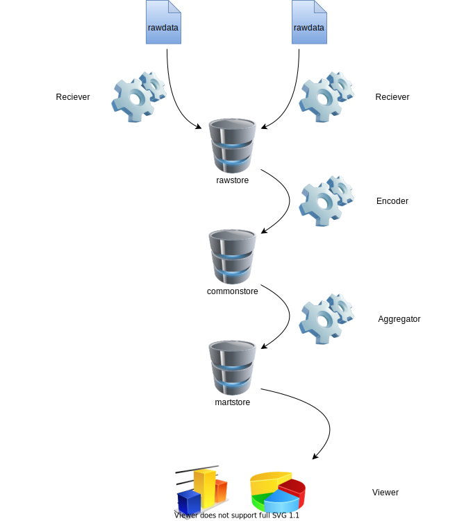

###################
System Configration
###################

TraISAREは6つのコンポーネントで構成する。

Function
********
Receiver
---------
移動データを受信・取得しrawstoreに保存する機能である。データにより形式、更新頻度は異なるため、Receiverはデータ毎に設計する。

Encoder
--------
rawstoreのデータを統一データフォーマットTraIIReへ変換する機能である。TraISAREではcommonstoreにData matchingのための基本データを保有しており、Encoderはrawdataを基本データに対してマッチングさせながら変換する。

Aggregator
-----------
commonstoreのデータを操作し、データを表示用に集計、分析、出力jする機能である。Aggregatorは用途に応じて様々存在するが、具体的には以下の用途に使用する。

* Query Function
  
  Common Storeに対するクエリーを実行する。この機能は比較的小規模なデータに対して適用する。

* Statical Analytics Function
  
  Common Storeのデータに統計処理を実施して、集計結果を出力する。

* Machine Learning
  
  Common Storeのデータに機械学習を実施して、予測結果を出力する。例えば列車在線情報の遅れ情報より、未来の遅れを予測し、結果を出力する。

* API function
  
  Common Storeのデータを出力するためのインターフェイスで外部と連携するための機能である。データ出力フォーマットはNGSI-LD, GTFS, odptに対応する

Storage
*******
rawstore
--------
Receiverが受信・取得したデータを保存するストレージである。データ形式は様々であるが、rawstoreでは素のデータを保存する

commonstore
-----------
TraISAREの基本データとTraIIReデータを保存するストレージである。commonstoreに保存されるデータはTraIIReデータフォーマットに変換されたものである。

martstore
---------
Aggregatorで集計、分析した結果を保存するストレージである。

Viewer
******
martstoreのデータを表示するユーザインターフェイスである。ダッシュボードを作成、保存したり、ユーザの閲覧権限を管理したりする。

