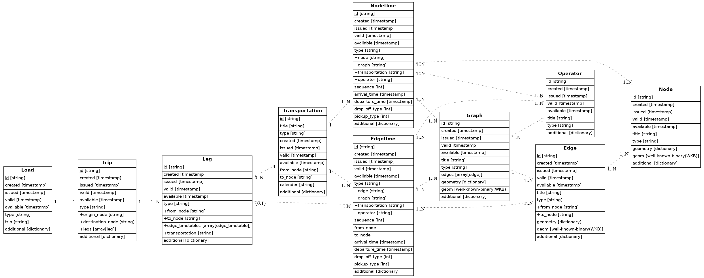

# TraIIRe
## About
TraIIReは移動情報の中間表現である。TraIIReは各事業者から出力されるデータを中間表現に変換する。最近、交通情報が各社から提供されるようになってきたが、別々のフォーマットを採用し、事業者間でのデータのやりとりに多大なコストがかかる。現在、GTFSによるデータ提供が各社から開始されつつあるが、乗換及び運行に関する情報にフォーカスしており、移動情報として必要となる施設情報やバリアフリー情報などをやりとりすることはできない。TraIIReでは移動に必要となる情報のやりとりを円滑に行うために必要となる中間表現を定義する。

## Data Lifespan
交通データは静的情報と動的情報に分類できる。静的情報は駅情報、路線情報、時刻表といった情報で、一定期間有効かつ状態が変化しない情報を指す。動的情報は列車位置情報、運行情報、渋滞情報といった時々刻々と状態が変化する情報を指す。TraISAREでは情報が静的である場合はデータをグラフ構造上で表現する。この静的情報を扱うデータフォーマットをTraIIReと呼ぶ。一方、動的情報はTraIIReで表現するグラフ構造上の各データにおける属性情報として表現する。なぜなら動的な情報は観測する点を固定することにより時々刻々と変化するように見えるからである。この動的情報を扱うフォーマットをTraIIRe上のリアルタイム情報という意味でTraIIReR(**Tra**nsportation **I**nformation **I**ntermidiate **Re**presentation for **R**eal-time data)と呼ぶ。

## Basis in TraIIRe
移動とは、物体がある手段（移動手段）を利用し、ある時間における場所（位置）から、ある経路を経由して、別の場所（位置）に動くことである。この定義より、移動の定義には以下の要素が必要になると考えられる。
- 物体: Object
- 移動手段: Transportation
- 場所（位置）: Place(Coordinate)
- 経路: Route

これら要素を図示すると以下のようになる。

.. graphviz::
   Basic model of transport {
    scale 2.0 (Node) as N1 (Node) as N2 N1 --right--&gt; N2: Edge legend
    center Load endlegend legend center Transportation endlegend
   }

コンピューターシステムで扱う場合、場所を頂点、経路を辺としたグラフ構造を形成し、その上を移動体（Object）が動く、というモデルに落とし込める。本システムではこの三点をグラフ構造および移動の中間表現の基底として定義する。さらに交通の運行に必要な情報や、交通を利用する主体、主体の移動する経路を基底に加えることで、あらゆる交通情報を表現する基本モデルを構築する。このモデルでは静的情報を取り扱う。主に事業者の運行計画を表現することを想定しており、ダイヤ改正でデータを使用開始、次のダイヤ改正で使用終了する、というように比較的長期間使用する。

### Node  
Nodeは空間の1点を表す概念であり、グラフ構造における頂点に対応する。交通データにおいてNodeとは駅のプラットフォーム、バス停標柱、タクシー乗り場、空港のゲートなどを表す。

### Edge  
2つのNodeの関係を方向とともに表すベクトルであり、グラフ構造における辺に対応する。交通データにおいてEdgeとは駅間の線路、バス停間の道路などを表す。

### Graph  
Graphは空間を構成しているNodeとEdgeの集合でありグラフ構造そのものである。空間におけるNode, Edgeの部分的な集合はSub Graphと呼び、具体的には、列車やバスの運行系統を表す。(Sub Graph) ⊂ (Graph)の関係となる。TraIIReではいずれの集合もGraphと呼ぶ。交通データにおいてGraphは鉄道路線、バス運行系統などを表す。

### Nodetime
NodetimeはNodeに時刻情報を付加したものである。ここで表現する時刻は移動手段がNodeに到着した時刻、出発する時刻である。交通データにおいてNodetimeは駅、バス停標柱の時刻表などを表す。

### Edgetime
EdgetimeはEdgeに時刻情報を付加したものである。ここで表現する時刻は移動手段がEdge始点を出発する時刻、Edge終点に到着する時刻である。交通データにおいてEdgetimeは1駅間におけるダイヤグラムを表す

### Transportation  
Transportationは移動手段そのものを表す。交通データにおいてTransportationは鉄道車両、バス車両、タクシー車両などの移動体の表現するのに加え、徒歩といった移動体として実体のない移動手段も同一の基底で表現する。

### Load  
LoadはTransportationに積載され移動する主体を表す。具体的にはヒト、モノ、動物、貨物などで、自身は移動する手段を持たないものとする。例えばヒトが歩いて移動する際は、ヒトが「徒歩」というTransportationに乗って移動するものと考える。

### Trip  
TripはLoadの移動経路を表す。Loadは出発地から目的地へと移動する間に、様々な移動手段を使用する。例えば自宅から会社への通勤を考える。自宅から最寄り駅までは自転車、会社の最寄り駅までは電車、駅から会社までは徒歩、といった具合である。Tripでは目的地へ移動する際に利用したTransoprtationを、利用したOD毎に表す。

### Leg  
LegはEdgetimeに利用開始時刻と利用終了時刻を付加したものである。Tripが経由する経路の詳細を表すものであり、経路検索においては通過駅を表わすものである。

### Operator  
Operatorは実体を運用・保守・管理する組織を表す。会社の支店が正式な運行事業者となる場合、親として会社名をparentに格納する。

## Basis in TraIIReR
TraIReRはTraIIReで表現した基底に対して時々刻々と変化する値をその基底の属性として表現するデータ形式である。時々刻々変化する値とは各社の運行管理システム等から出力される車両の現在の運行情報を表すデータや、携帯電話回線を利用して取得する流動人口データなどである。TraIIReRで扱うデータは多頻度で受信、更新を繰り返し、データの鮮度も短いため、TraIIReとは異なったデータ管理が必要である。一方でTraIIReRデータはTraIIReにおける基底のいずれかの属性情報となるため、必ず対応するTraIIReデータの情報を保持する。
- Train  
Trainは鉄道車両を表すモデルで、鉄道車両のリアルタイム情報を表す。

### Train\_odpt  
Trainに相当する基底であるが、odptのリアルタイム情報のみを扱う。

### Bus  
Busはバス車両を表わすモデルで、バス車両のリアルタイム情報を表す。

### Car  
Carは自動車を表すモデルである。

### PeopleFlow  
PeopleFlowは人の流れを表すモデルで、人流のリアルタイム情報である。人流は人間を1人1人追うのではなく、1つの群として扱う。流れは起点、終点と量を定義すれば表現可能だが、1人1人の人間の起点と終点を考えると、無数の起点と終点の組み合わせがあるため、表現が難しい。そのため、地図をメッシュで区切り、起点メッシュと終点メッシュ間の移動量を人流として定義する。

### PeopleCount  
PeopleCountはある定点で観測する人の数(人数)である。PepleFlowと合わせて人流グラフ構造を形成する。

### Person  
Personは1人の人間を表すモデルで、人間のリアルタイム情報を表す。

