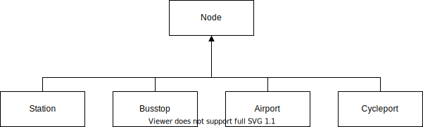

###################
Common Data Formats
###################
TraISAREが扱う共通データフォーマット、TraIIReを定義する。

TraIIRe
-------
TraIIRe(**Tra**\nsportation \ **I**\nformation \ **I**\ntermidiate \ **Re**\presentation)はcommonstoreにおけるデータフォーマットである。
移動履歴に関わる交通データにはICカードやアプリの乗車履歴を基にしたデータ、携帯電話の位置情報を基にした人流データ、自動車プローブデータなどが存在する。
これらデータは人流を表すデータであるとともに、公共交通インフラを計画する上で重要な基礎データとなりうるものである。
しかしこれらデータには定められたデータフォーマットが存在しないため、流通しているデータはデータを保有している各事業者が各々で構築したシステムから出力される独自フォーマットデータである。
そのため移動に関わるデータの分析は単一データ内で閉じており、複数のデータを横断した共有、分析の事例は少ない。これはデータフォーマットの統一、データ粒度の統一といった作業に大変なコストがかかるためである。
最近は `GTFS <https://developers.google.com/transit/?hl=ja>`_ によるデータ提供が各社から開始され、公共交通における統一データフォーマットのデファクトスタンダードとなりつつあるが、
乗換及び運行といった旅客案内に関するデータに特化しており、移動履歴を取り扱う統一データフォーマットは未だ存在しない。
TraISAREはすべて移動データを統一データフォーマット上で扱うことを目的としており、TraIIReはその核となるデータ構造を定義するものである。

Graph Data Structure
--------------------
TraIIReではある場所からある場所に向かって物体が移動手段を使って動くことを移動と定義する。
この定義から、以下の関係を持たせたとき、そのデータ構造はグラフとグラフ上を動く移動手段で表現できる。

* ある場所: Node
* ある場所からある場所: Edge
* 物体: Load
* 移動手段: Transportation

これら要素にStatic Dataの要素を加えたものをTraIIReの基底フォーマットとする。

Class
-----
すべてのClassはEssentialを基底Classとした継承関係にある。
Classのプロパティに他のClass名が存在するときは、Classのuidを参照しているものとする。
Class名.Property名という形式でPropertyが記述されたときは、当該Classの当該Propertyを参照しているものとする

(Under construction)

Entity Relationships and Structures
-----------------------------------

.. toctree::
   :maxdepth: 2

   TraIIRe.md
   Train.md
   Bus.md
   PersonTravel.md
   
